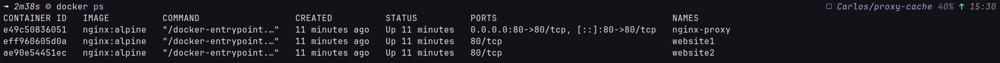

# Proyecto: Proxy Inverso con Balanceo de Carga — nginx + Docker

**Alumno:** Hugo Mata

---

## Índice

1. [Descripción general](#1-descripci%C3%B3n-general)
2. [Fase 1 — Configuración inicial de Docker Compose](#2-fase-1--configuraci%C3%B3n-inicial-de-docker-compose)
3. [Fase 2 — Proxy inverso](#3-fase-2--proxy-inverso)
4. [Fase 3 — Balanceo de carga](#4-fase-3--balanceo-de-carga)
5. [Fase 4 — Sitio web](#5-fase-4--sitio-web)
6. [Problemas encontrados](#6-problemas-encontrados)
7. [Capturas de pantalla](#7-capturas-de-pantalla)
8. [Conclusión](#8-conclusi%C3%B3n)

---

## 1. Descripción general

El objetivo del proyecto es desplegar un entorno con **Docker Compose** formado por tres contenedores:

- **proxy** — nginx actuando como proxy inverso, único contenedor expuesto al exterior (puerto 80).
- **website1** y **website2** — dos contenedores nginx internos que sirven el sitio web estático, sin puertos expuestos.

El proxy recibe todas las peticiones del cliente y las reenvía a uno de los dos backends siguiendo un algoritmo de **round-robin**, distribuyendo la carga de forma equitativa.

### Estructura de ficheros

```
proyecto/
├── docker-compose.yml
├── conf/
│   └── nginx.conf
└── html/
    ├── index.html
    ├── calamot_hero.jpg
    ├── calamot_1.jpg
    ├── calamot_2.jpg
    └── calamot_3.mp4
```

### Diagrama de la arquitectura

```
Cliente (navegador)
        │
        ▼ :80
  ┌─────────────┐
  │    proxy    │  nginx — proxy inverso
  └──────┬──────┘
         │  round-robin
    ┌────┴────┐
    ▼         ▼
┌────────┐ ┌────────┐
│website1│ │website2│  nginx — servidores web internos
└────────┘ └────────┘
```

---

## 2. Fase 1 — Configuración inicial de Docker Compose

### Qué hemos hecho

Creamos el fichero `docker-compose.yml` con los tres servicios. Los contenedores `website1` y `website2` montan la carpeta `./html` completa en `/usr/share/nginx/html`, de modo que cualquier fichero añadido a esa carpeta queda disponible sin tocar el compose. El contenedor `proxy` monta únicamente el fichero de configuración `./conf/nginx.conf`.

```yaml
services:
  website1:
    image: nginx:alpine
    container_name: website1
    restart: unless-stopped
    volumes:
      - ./html:/usr/share/nginx/html:ro

  website2:
    image: nginx:alpine
    container_name: website2
    restart: unless-stopped
    volumes:
      - ./html:/usr/share/nginx/html:ro

  proxy:
    image: nginx:alpine
    container_name: nginx-proxy
    restart: unless-stopped
    ports:
      - "80:80"
    volumes:
      - ./conf/nginx.conf:/etc/nginx/nginx.conf:ro
    depends_on:
      - website1
      - website2
```

---

## 3. Fase 2 — Proxy inverso

### Qué hemos hecho

Configuramos nginx como **proxy inverso**: el contenedor `proxy` recibe las peticiones HTTP en el puerto 80 y las reenvía internamente a los backends usando el nombre de servicio de Docker (`website1`, `website2`). Docker resuelve estos nombres automáticamente mediante su DNS interno.

Añadimos las cabeceras estándar para que el backend sepa la IP real del cliente original:

```nginx
proxy_set_header Host              $host;
proxy_set_header X-Real-IP         $remote_addr;
proxy_set_header X-Forwarded-For   $proxy_add_x_forwarded_for;
proxy_set_header X-Forwarded-Proto $scheme;
```

También añadimos `X-Served-By` para poder demostrar que el proxy está en medio:

```nginx
add_header X-Served-By "nginx-proxy";
```

### Cómo verificarlo

Abrir las DevTools del navegador → pestaña **Red** → hacer clic en cualquier petición → sección **Cabeceras de respuesta**. Debe aparecer:

```
X-Served-By: nginx-proxy
```

---

## 4. Fase 3 — Balanceo de carga

### Qué hemos hecho

Definimos un bloque `upstream` en `nginx.conf` que agrupa los dos backends. nginx distribuye las peticiones entre ellos en **round-robin** (por defecto): la primera petición va a `website1`, la segunda a `website2`, la tercera a `website1`, y así sucesivamente.

```nginx
upstream website_pool {
  server website1:80;
  server website2:80;
}
```

Añadimos la cabecera `X-Backend` para ver en tiempo real a qué contenedor va cada petición:

```nginx
add_header X-Backend $upstream_addr;
```

El fichero `nginx.conf` completo queda así:

```nginx
events {
  worker_connections 1024;
}

http {
  upstream website_pool {
    server website1:80;
    server website2:80;
  }

  server {
    listen 80;
    server_name _;

    location / {
      proxy_pass         http://website_pool;
      proxy_set_header Host            $host;
      proxy_set_header X-Real-IP       $remote_addr;
      proxy_set_header X-Forwarded-For $proxy_add_x_forwarded_for;
      proxy_set_header X-Forwarded-Proto $scheme;
      add_header X-Served-By "nginx-proxy";
      add_header X-Backend   $upstream_addr;
    }
  }
}
```

### Cómo verificarlo

En las DevTools → cabeceras de respuesta, la cabecera `X-Backend` muestra la IP interna del contenedor que respondió. Al recargar varias veces, la IP alterna entre los dos backends, demostrando el round-robin.

---

## 5. Fase 4 — Sitio web

### Qué hemos hecho

Creamos el sitio web estático en la carpeta `html/`. La página incluye:

- Una imagen principal del IES El Calamot.
- Una cuadrícula con dos imágenes adicionales.
- Un reproductor de vídeo.
- Una sección de metadatos que muestra la hora de carga en tiempo real.

Al montar toda la carpeta `./html` en lugar de fichero a fichero, añadir nuevos recursos (imágenes, vídeos) no requiere modificar el `docker-compose.yml`.

---

## 6. Problemas encontrados

### Error de iptables al arrancar Docker Compose

Al ejecutar `docker compose up -d` por primera vez, obtuvimos el siguiente error:

```
failed to create network: Failed to Setup IP tables: Unable to enable NAT rule:
iptables v1.8.12 (nf_tables): RULE_INSERT failed (No such file or directory)
```

**Causa:** el sistema usa el backend `nf_tables` de iptables, que no es compatible con la versión de Docker instalada.

**Solución:** cambiar iptables al modo legacy:

```bash
sudo update-alternatives --set iptables /usr/sbin/iptables-legacy
sudo update-alternatives --set ip6tables /usr/sbin/ip6tables-legacy
```

Tras ejecutar estos comandos, `docker compose up -d` funcionó correctamente.

---

## 7. Capturas de pantalla

### 7.1 Contenedores en ejecución



---

### 7.2 Sitio web funcionando en el navegador

![[./readme/proxy-cache-4.png]]

---

### 7.3 Proxy inverso — cabecera X-Served-By

![[./readme/proxy-cache-1.png]]
En la captura se pueden ver las peticiones en 'Transfered: cached' y a la derecha el X-Server-By: nginx-proxy

---

### 7.4 Balanceo de carga — cabecera X-Backend alternando


![[./readme/proxy-cache-3.png]]
![[./readme/proxy-cache-2.png]]
En estas capturas podemos ver que en una de las peticiones al recargar pagina cambia la ip asignada al X-Backend.

---

### 7.5 Logs de nginx mostrando peticiones distribuidas

![[./readme/proxy-cache-6.png]]

---

## 8. Conclusión

En este proyecto hemos desplegado una infraestructura de red con Docker Compose que implementa:

- Un **proxy inverso** con nginx, que intercepta todas las peticiones y las redirige a los backends internos.
- **Balanceo de carga** en round-robin entre dos servidores web idénticos, mejorando la disponibilidad y distribuyendo el tráfico.
- Un **sitio web estático** con imágenes y vídeo, servido desde una carpeta compartida entre los dos backends.

La arquitectura es fácilmente escalable: añadir un tercer backend sería tan sencillo como declarar un nuevo servicio en el `docker-compose.yml` y añadir su nombre al bloque `upstream` de `nginx.conf`.
